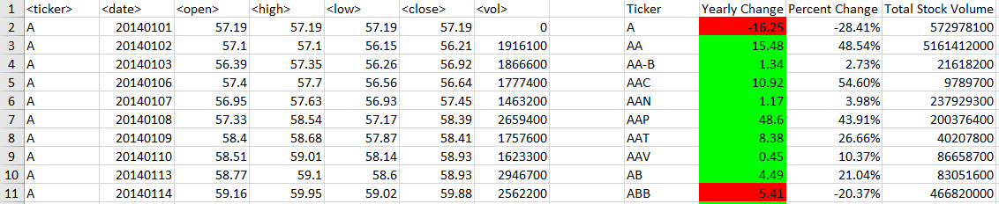
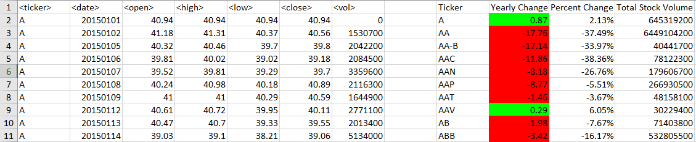
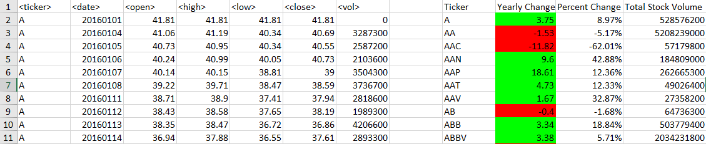

# VBA-challenge

### Files

* [Stock Data](Resources/Multiple_year_stock_data.xlsx) - File that included all the stock data used.

* A script was made that loops through all the stocks for 2014, 2015, and 2016 (multiple worksheets) and outputs the following information.

  * The ticker symbol.

  * Yearly change from opening price at the beginning of a given year to the closing price at the end of that year.

  * The percent change from opening price at the beginning of a given year to the closing price at the end of that year.

  * The total stock volume of the stock.

  * Conditional formatting that highlights positive change in green and negative change in red.
  
 ## Results
  
  **2014**
  
  
  
  **2015**
  
  
  
  **2016**
  
  
